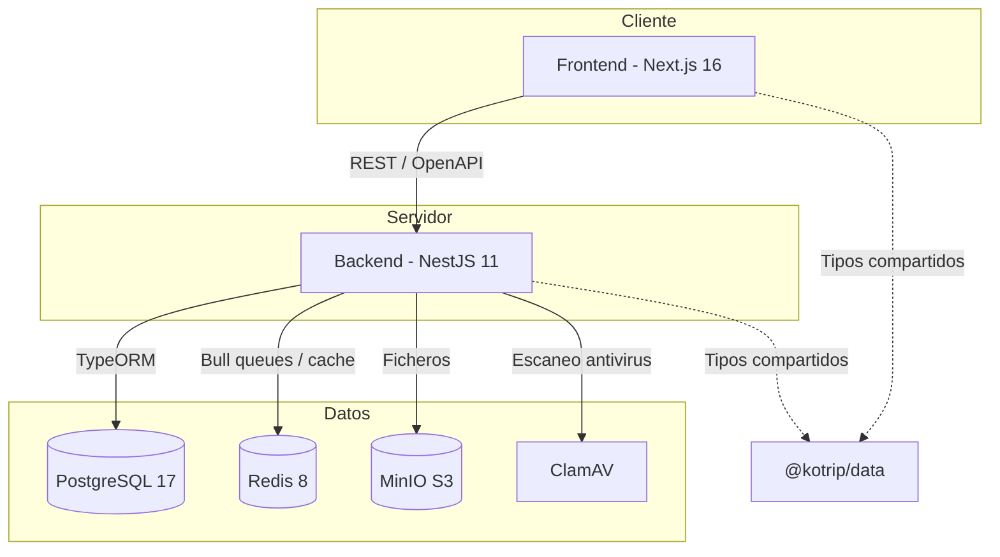
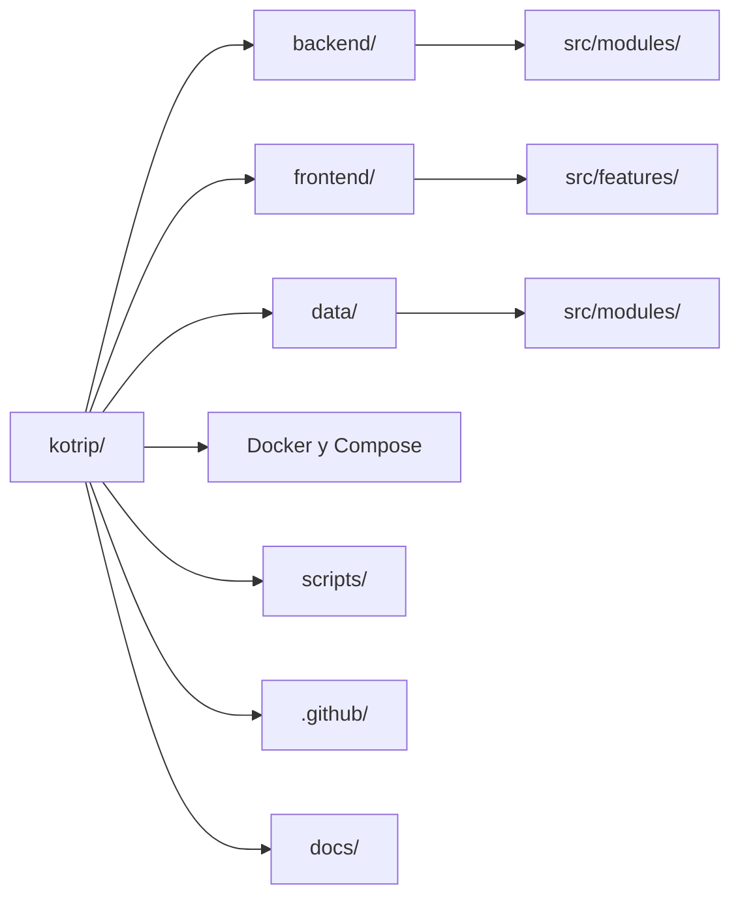
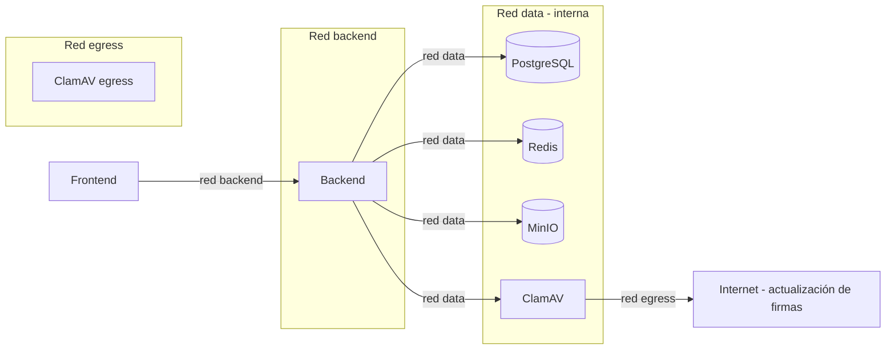

# Kotrip

Plataforma colaborativa de planificación y gestión de viajes. Permite a los usuarios crear viajes, invitar miembros, organizar itinerarios con paradas geolocalizadas, gestionar gastos compartidos y adjuntar tickets o documentos a cada punto del recorrido.

El proyecto está organizado como un monorepo con tres paquetes npm (workspaces): un backend API, un frontend web y un paquete compartido de tipos y constantes.

## Arquitectura general



Los tres paquetes comparten una única instalación de dependencias, configuración de TypeScript estricta, ESLint, Prettier y Syncpack para mantener versiones sincronizadas.

## Stack tecnológico

| Capa | Tecnologías principales |
| --- | --- |
| Frontend | Next.js 16 (App Router), React 19, Tailwind CSS 4, HeroUI v3, openapi-fetch, next-intl, React Hook Form, Zod, Tiptap, Leaflet |
| Backend | NestJS 11, Fastify, TypeORM, Bull (colas), class-validator, nestjs-i18n, Swagger/OpenAPI |
| Datos compartidos | TypeScript (enums, constantes, tipos) |
| Base de datos | PostgreSQL 17 |
| Cache y colas | Redis 8 |
| Almacenamiento | MinIO (compatible S3) |
| Seguridad | JWT (access + refresh), ClamAV (antivirus), cifrado simétrico |
| Infraestructura | Docker, Docker Compose, Makefile |
| QA | ESLint, Prettier, Syncpack, Knip, Lefthook (hooks de git), Commitlint |
| CI/CD | GitHub Actions (quality, commitlint, docs) |
| Documentación | Compodoc (backend), TypeDoc (frontend y data) |

## Estructura del repositorio



| Directorio | Descripción                                         |
| ---------- | --------------------------------------------------- |
| backend/   | Servidor API REST con NestJS y Fastify              |
| frontend/  | Aplicación web con Next.js y React                  |
| data/      | Paquete de tipos, enums y constantes compartidas    |
| docs/      | Documentación técnica (API, entidades, localidades) |
| scripts/   | Scripts de postinstalación y utilidades             |
| .github/   | Workflows de CI/CD y plantillas de issues           |

## Requisitos previos

- Node.js 24
- Docker y Docker Compose
- Git
- Make (opcional, para atajos de comandos)

## Configuración del entorno

1. Clonar el repositorio:

```bash
git clone <url-del-repositorio>
cd kotrip
```

2. Copiar el archivo de variables de entorno y rellenar los valores requeridos:

```bash
cp .env.example .env
```

Cada variable está documentada en el propio archivo `.env.example`. Las variables marcadas como REQUIRED son obligatorias. Para generar secretos criptográficos se incluyen comandos `openssl` como referencia junto a cada variable.

Resumen de secciones del `.env`:

| Sección | Variables principales |
| --- | --- |
| General | NODE_ENV, TZ, FALLBACK_LANGUAGE, STACK_INDEX |
| PostgreSQL | POSTGRES_USER, POSTGRES_PASSWORD, POSTGRES_DB |
| Redis | BACKEND_REDIS_PASSWORD |
| MinIO | MINIO_ROOT_USER, MINIO_ROOT_PASSWORD, MINIO_DEFAULT_BUCKET |
| ClamAV | Tamaños máximos de fichero y escaneo (opcionales) |
| Seguridad | ENCRYPTION_KEY, IV, RESET_KEY |
| JWT | JWT_SECRET, JWT_REFRESH_SECRET, JWT_EXPIRATION, JWT_REFRESH_EXPIRATION |
| Frontend Auth | AUTH_SECRET |
| Cookies | COOKIE_SECURE, duraciones de tokens |
| Conexión backend | BACKEND_CLUSTER_HOST, BACKEND_CLUSTER_PORT |

3. Instalar dependencias:

```bash
npm ci
```

Este comando ejecuta automáticamente el hook `postinstall`, que instala los hooks de git (Lefthook) y descarga las localidades de España desde la API pública de OpenDataSoft.

## Desarrollo

### Inicio rápido

Para levantar todo el entorno de desarrollo con un solo comando:

```bash
make dev-reup
```

Esto destruye los volúmenes existentes, reconstruye las imágenes y levanta todos los servicios con hot-reload habilitado, incluyendo las herramientas de desarrollo (PGAdmin, RedisInsight, BullBoard).

### Servicios y puertos (desarrollo)

| Servicio      | Puerto | Descripción                |
| ------------- | ------ | -------------------------- |
| Frontend      | 3060   | Aplicación web Next.js     |
| Backend       | 3050   | API REST NestJS            |
| PostgreSQL    | 3030   | Base de datos relacional   |
| Redis         | 3031   | Cache y colas              |
| MinIO API     | 3032   | Almacenamiento de ficheros |
| MinIO Console | 3033   | Consola web de MinIO       |
| PGAdmin       | 3040   | GUI de PostgreSQL          |
| RedisInsight  | 3041   | GUI de Redis               |
| BullBoard     | 3042   | Visualizador de colas      |

### Comandos de Docker Compose

El proyecto usa archivos Compose separados por servicio y modo:

| Archivo                  | Contenido                                 |
| ------------------------ | ----------------------------------------- |
| compose.backend.yml      | Backend + servicios de datos (producción) |
| compose.backend.dev.yml  | Override de desarrollo para backend       |
| compose.frontend.yml     | Frontend (producción)                     |
| compose.frontend.dev.yml | Override de desarrollo para frontend      |
| compose.networks.yml     | Definiciones de redes compartidas         |

### Comandos Make disponibles

```bash
make help                      # Muestra todos los objetivos disponibles
make dev-reup                  # Reinicia entorno completo de desarrollo
make dev-backend-reup          # Solo backend con servicios de datos
make dev-backend-reup-devtools # Backend con PGAdmin, RedisInsight, BullBoard
make dev-frontend-reup         # Solo frontend
make dev-build                 # Reconstruye imágenes de desarrollo
make dev-build-no-cache        # Reconstruye sin cache de Docker
make prod-reup                 # Reinicia entorno de producción
make prod-build                # Construye imágenes de producción
make prod-build-no-cache       # Producción sin cache
make logs                      # Muestra logs de todos los contenedores
make all-down                  # Detiene todos los contenedores
make all-down-volumes          # Detiene contenedores y elimina volúmenes
```

### Hot-reload

En desarrollo, los directorios de código fuente se montan como volúmenes en los contenedores. Cualquier cambio en archivos dentro de `backend/src/`, `frontend/src/` o `data/src/` dispara la recarga automática del servicio correspondiente sin necesidad de reiniciar manualmente.

## Producción

### Construcción de imágenes

El proyecto usa un único `Dockerfile` multi-stage que genera imágenes optimizadas para producción:

```bash
make prod-build
```

Características de las imágenes de producción:

- Ejecución con usuario no root (`node`) por seguridad
- Sin dependencias de desarrollo
- Frontend con salida standalone de Next.js (servidor autocontenido)
- Backend compilado con SWC
- Cache mounts de npm para builds rápidos

### Despliegue

```bash
make prod-reup
```

Las imágenes de producción exponen los mismos puertos (3050 para backend, 3060 para frontend). La variable `STACK_INDEX` permite desplegar múltiples instancias con puertos diferentes (ej: stack 1 usa 3150/3160).

### Redes Docker



- red `data`: interna, sin acceso externo. Conecta los servicios de datos con el backend.
- red `backend`: permite la comunicación entre frontend y backend.
- red `egress`: permite a ClamAV descargar actualizaciones de firmas de virus.

## QA y calidad de código

### Comandos de calidad

```bash
npm run qa                # Ejecuta todas las verificaciones en orden
npm run qa:compile        # Verificación de tipos TypeScript (todos los workspaces)
npm run qa:format         # Comprueba formato con Prettier
npm run qa:format:fix     # Corrige formato automáticamente
npm run qa:lint           # Linting con ESLint (todos los workspaces)
npm run qa:lint:fix       # Corrige problemas de lint automáticamente
npm run qa:versions       # Verifica versiones sincronizadas con Syncpack
npm run qa:usage          # Detección de código sin usar con Knip
```

### Hooks de git (Lefthook)

| Hook       | Acción                                            |
| ---------- | ------------------------------------------------- |
| pre-commit | Formato automático con Prettier                   |
| commit-msg | Validación de Conventional Commits via Commitlint |
| pre-push   | Verificación de tipos TypeScript                  |

### Conventional Commits

El proyecto exige el formato de Conventional Commits para todos los mensajes de commit:

```
tipo(scope): descripción breve

Cuerpo opcional
```

Tipos comunes: `feat`, `fix`, `refactor`, `docs`, `style`, `test`, `chore`.

## CI/CD

| Workflow | Trigger | Función |
| --- | --- | --- |
| ci-quality.yml | Push y PRs en todas las ramas | Formato, versiones, tipos, lint |
| ci-commitlint.yml | Push y PRs en todas las ramas | Validación de Conventional Commits |
| cd-docs.yml | Merge en `stable` | Genera documentación con Compodoc y TypeDoc, la publica en GitHub Pages |

## Documentación adicional

- [backend/README.md](backend/README.md): documentación del paquete backend (incluye referencia API, modelo de entidades y localidades)
- [frontend/README.md](frontend/README.md): documentación del paquete frontend
- [data/README.md](data/README.md): documentación del paquete de tipos compartidos

## Autor

Paulo Sánchez - [github.com/erlete](https://github.com/erlete)

## Licencia

Proyecto privado (UNLICENSED).
