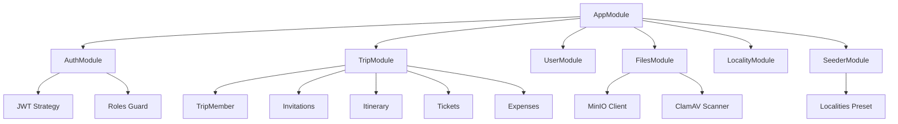
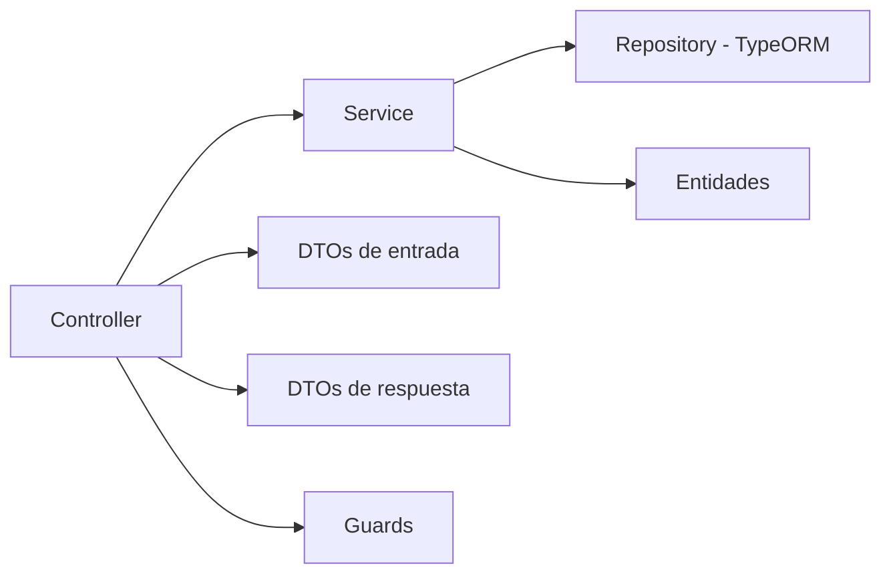
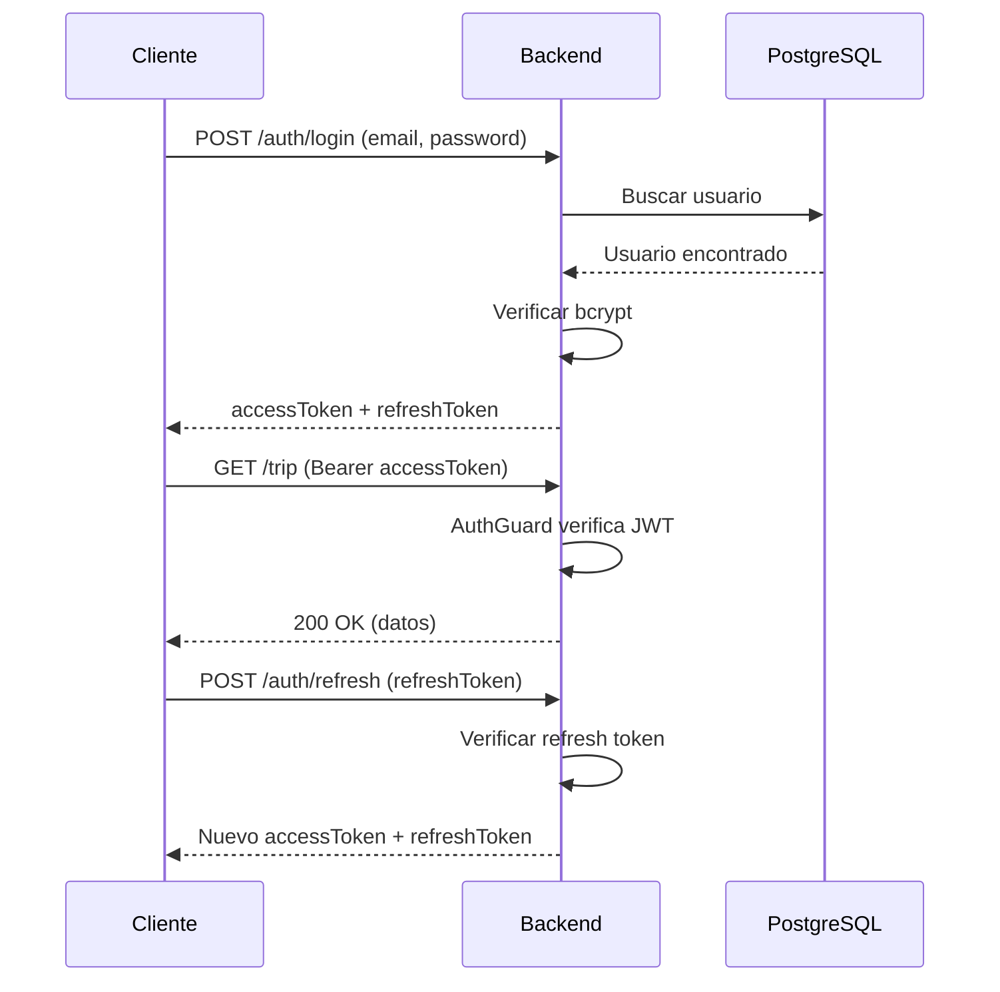
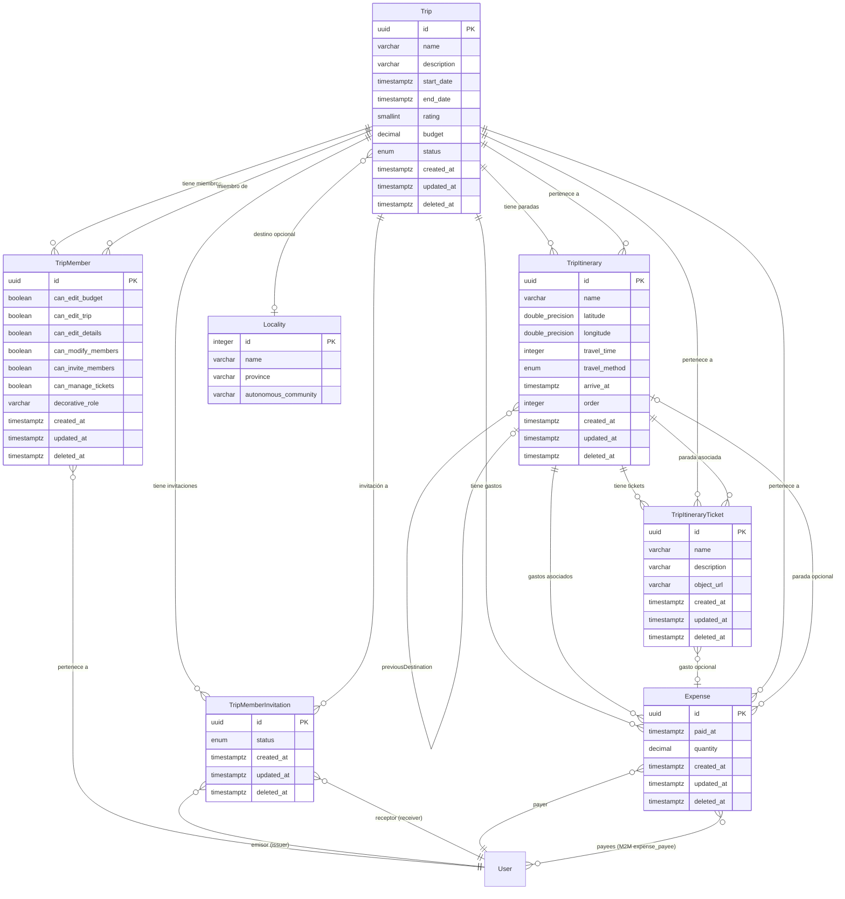

# @kotrip/backend

Servidor API REST de la plataforma Kotrip, construido con NestJS 11 sobre Fastify. Gestiona la lógica de negocio de viajes, autenticación, almacenamiento de ficheros, colas de trabajo y la comunicación con los servicios de datos (PostgreSQL, Redis, MinIO, ClamAV).

## Stack tecnológico

| Categoría            | Tecnología                             |
| -------------------- | -------------------------------------- |
| Framework            | NestJS 11 + Fastify                    |
| Base de datos        | PostgreSQL 17 vía TypeORM              |
| Colas                | Bull (sobre Redis)                     |
| Almacenamiento       | MinIO (compatible S3)                  |
| Antivirus            | ClamAV                                 |
| Autenticación        | JWT (access + refresh tokens)          |
| Validación           | class-validator + class-transformer    |
| Documentación API    | Swagger / OpenAPI                      |
| Internacionalización | nestjs-i18n (ES, EN, GL)               |
| Compilación          | SWC (producción), ts-node (desarrollo) |
| Tests                | Jest                                   |

## Arquitectura de módulos



## Estructura del código fuente

```
src/
  main.ts                        # Punto de entrada de la aplicación
  app.module.ts                  # Módulo raíz con todas las integraciones
  modules/
    auth/                        # Autenticación y autorización
      dto/                       # DTOs de entrada (login, register, etc.)
      guard/                     # Guards de JWT, roles y permisos
      services/                  # Lógica de autenticación
      auth.controller.ts
      auth.module.ts
    trip/                        # Dominio principal de viajes
      dto/                       # DTOs de entrada
      dto-outputs/               # DTOs de respuesta
      entities/                  # Entidades TypeORM
      guard/                     # Guards de permisos de viaje
      services/                  # Lógica de negocio
      trip.controller.ts
      trip.module.ts
    user/                        # Gestión de usuarios
      dto/
      dto-outputs/
      entities/
      services/
      user.controller.ts
      user.module.ts
    files/                       # Almacenamiento y escaneo de ficheros
      services/
      files.controller.ts
      files.module.ts
    locality/                    # Municipios de España (solo lectura)
      entities/
      locality.controller.ts
      locality.module.ts
    seeder/                      # Carga de datos iniciales
      presets/                   # Presets de datos (localidades, etc.)
      inputs/                    # Archivos JSON de entrada
      seeder.module.ts
  common/                        # Utilidades compartidas
    decorators/                  # Decoradores personalizados (@Auth, etc.)
    interceptors/                # Interceptores HTTP
    pipes/                       # Pipes de validación
    error-handling/              # Manejo centralizado de errores
    services/                    # Servicios transversales
    utils/                       # Funciones auxiliares
  lib/                           # Librerías internas
    data/                        # Entidades base (CUDTzEntity)
    pagination/                  # Librería de paginación por cursor
  i18n/                          # Archivos de traducción (ES, EN)
```

## Patrón de módulo

Cada módulo sigue una estructura consistente:



- El controller recibe las peticiones HTTP y delega en los servicios.
- Los servicios contienen la lógica de negocio y operan sobre los repositorios.
- Los DTOs de entrada validan los datos con class-validator.
- Los DTOs de respuesta dan forma a las respuestas de la API.
- Los guards protegen los endpoints con autenticación JWT y permisos granulares.

## Sistema de autenticación



Flujo de autorización en endpoints de viaje:

1. AuthGuard: verifica el JWT y extrae el usuario autenticado.
2. TripMemberGuard: verifica que el usuario es miembro del viaje.
3. TripPermissionGuard: verifica que el miembro tiene el permiso requerido (canEditTrip, canEditBudget, etc.).

## Sistema de permisos de viaje

Los permisos son campos booleanos en la entidad TripMember:

| Permiso          | Permite                             |
| ---------------- | ----------------------------------- |
| canEditTrip      | Modificar datos generales del viaje |
| canEditBudget    | Gestionar gastos                    |
| canEditDetails   | Modificar el itinerario             |
| canModifyMembers | Añadir o eliminar miembros          |
| canInviteMembers | Enviar invitaciones                 |
| canManageTickets | Gestionar tickets y documentos      |

El creador del viaje recibe automáticamente todos los permisos activados.

## Paginación por cursor

El backend incluye una librería de paginación por cursor en `src/lib/pagination/`. Permite definir esquemas de paginación con ordenación y filtrado sobre cualquier entidad, produciendo consultas eficientes sin offsets.

## Comandos

```bash
npm run build:dev          # Compilación de desarrollo
npm run build:prod         # Compilación de producción con SWC
npm run start:dev          # Modo watch con NestJS CLI
npm run start:prod         # Ejecución del build compilado
npm run qa:compile         # Verificación de tipos sin emitir
npm run qa:lint            # Linting con ESLint
npm run qa:lint:fix        # Corregir problemas de lint
npm run qa:test            # Tests unitarios con Jest
npm run qa:test:e2e        # Tests end-to-end
npm run qa:test:cov        # Tests con cobertura
npm run qa:docs            # Generar documentación con Compodoc
```

## Documentación Swagger

La documentación Swagger se genera automáticamente y está disponible en:

```
http://localhost:3050/api
```

## Internacionalización

El backend soporta tres idiomas para mensajes de error y validación:

- Español (es, por defecto)
- Inglés (en)
- Gallego (gl)

Los archivos de traducción se encuentran en `src/i18n/`.

---

# Referencia de la API REST

Documentación completa de los endpoints REST de la plataforma Kotrip. Todos los endpoints están protegidos con autenticación JWT (Bearer Token) y requieren que el usuario tenga un rol válido (`USER` o `ADMIN`).

Archivos fuente:

- `src/modules/trip/trip.controller.ts`
- `src/modules/trip/dto/*.ts`
- `src/modules/trip/dto-outputs/*.ts`
- `src/modules/locality/locality.controller.ts`

## Información general

### Autenticación

Todos los endpoints requieren un token JWT válido en la cabecera `Authorization`:

```
Authorization: Bearer <access_token>
```

### Roles

Cada endpoint está restringido a usuarios con rol `USER` o `ADMIN` mediante el decorador `@Auth(Role.USER, Role.ADMIN)`.

### Formato de respuesta de error

Las respuestas de error siguen el formato estándar de NestJS:

```json
{
  "statusCode": 400,
  "message": "Mensaje de error localizado",
  "error": "Bad Request"
}
```

## Sistema de permisos (API)

### Guards de autorización

Los endpoints del dominio de viajes utilizan un sistema de guards en cadena:

1. AuthGuard (JWT): Verifica el token JWT y extrae el usuario autenticado.
2. TripMemberGuard: Verifica que el usuario autenticado es miembro del viaje indicado por `:id`.
3. TripPermissionGuard: Verifica que el miembro posee el permiso específico requerido por el endpoint (indicado con el decorador `@TripPermission('...')`).

### Permisos disponibles

Los permisos se definen como campos booleanos en la entidad `TripMember` y se verifican mediante el decorador `@TripPermission()`:

| Permiso | Descripción | Endpoints protegidos |
| --- | --- | --- |
| `canEditTrip` | Modificar datos generales del viaje | PUT/DELETE `/trip/:id` |
| `canEditBudget` | Gestionar gastos del viaje | CRUD `/trip/:id/expense/...` |
| `canEditDetails` | Modificar el itinerario | CRUD `/trip/:id/itinerary/...` |
| `canModifyMembers` | Añadir o eliminar miembros directamente | POST/PUT/DELETE `/trip/:id/member/...` |
| `canInviteMembers` | Enviar invitaciones | POST `/trip/:id/invitation` |
| `canManageTickets` | Gestionar tickets y documentos | CRUD `/trip/:id/ticket/...` |

> Nota: El creador del viaje recibe automáticamente todos los permisos activados al crear el viaje.

## 1. Viajes (Trips)

### `POST /trip` - Crear un nuevo viaje

Crea un viaje nuevo. El usuario autenticado se registra automáticamente como miembro con todos los permisos activados.

Autenticación: JWT (`USER`, `ADMIN`) Permisos: Ninguno adicional (cualquier usuario autenticado).

#### Cuerpo de la petición (`CreateTripDto`)

| Campo | Tipo | Requerido | Descripción |
| --- | --- | --- | --- |
| `name` | `string` | Sí | Nombre del viaje (3-100 caracteres). |
| `description` | `string` | No | Descripción del viaje (máx 2000 caracteres). |
| `startDate` | `string` | Sí | Fecha de inicio (ISO 8601). |
| `endDate` | `string` | Sí | Fecha de fin (ISO 8601). |
| `budget` | `number` | No | Presupuesto estimado en EUR (positivo). |
| `localityId` | `number` | No | ID de la localidad asociada. |

#### Ejemplo de petición

```json
{
  "name": "Viaje a Madrid",
  "description": "Un viaje cultural por la capital de España",
  "startDate": "2026-06-01T00:00:00.000Z",
  "endDate": "2026-06-10T00:00:00.000Z",
  "budget": 1500.0,
  "localityId": 1
}
```

#### Respuesta exitosa (`201 Created`) - `TripOutputDto`

```json
{
  "id": "a1b2c3d4-e5f6-7890-abcd-ef1234567890",
  "name": "Viaje a Madrid",
  "description": "Un viaje cultural por la capital de España",
  "startDate": "2026-06-01T00:00:00.000Z",
  "endDate": "2026-06-10T00:00:00.000Z",
  "rating": null,
  "budget": 1500.0,
  "status": "PLANNED",
  "locality": {
    "id": 1,
    "name": "Madrid",
    "province": "Madrid",
    "autonomousCommunity": "Comunidad de Madrid"
  },
  "memberCount": 1,
  "createdAt": "2026-03-12T10:00:00.000Z",
  "updatedAt": "2026-03-12T10:00:00.000Z"
}
```

#### Errores posibles

| Código | Descripción                     |
| ------ | ------------------------------- |
| `400`  | Datos inválidos en la petición. |
| `401`  | No autorizado (token inválido). |

---

### `GET /trip` - Listar viajes del usuario

Obtiene la lista de viajes en los que el usuario autenticado participa como miembro.

Autenticación: JWT (`USER`, `ADMIN`) Permisos: Ninguno adicional.

#### Respuesta exitosa (`200 OK`) - `TripListOutputDto[]`

```json
[
  {
    "id": "a1b2c3d4-e5f6-7890-abcd-ef1234567890",
    "name": "Viaje a Madrid",
    "description": "Un viaje cultural por la capital",
    "startDate": "2026-06-01T00:00:00.000Z",
    "endDate": "2026-06-10T00:00:00.000Z",
    "status": "PLANNED",
    "memberCount": 3,
    "localityName": "Madrid"
  }
]
```

---

### `GET /trip/:id` - Obtener detalle de un viaje

Obtiene la información completa de un viaje específico.

Autenticación: JWT (`USER`, `ADMIN`) Guards: `TripMemberGuard`, `TripPermissionGuard`

| Parámetro | Tipo   | Descripción     |
| --------- | ------ | --------------- |
| `id`      | `UUID` | UUID del viaje. |

#### Respuesta exitosa (`200 OK`) - `TripOutputDto`

Misma estructura que la respuesta de `POST /trip`.

#### Errores posibles

| Código | Descripción              |
| ------ | ------------------------ |
| `403`  | No es miembro del viaje. |
| `404`  | Viaje no encontrado.     |

---

### `PUT /trip/:id` - Actualizar un viaje

Actualiza los datos de un viaje existente.

Autenticación: JWT (`USER`, `ADMIN`) Guards: `TripMemberGuard`, `TripPermissionGuard` Permiso requerido: `canEditTrip`

#### Cuerpo de la petición (`UpdateTripDto`)

Todos los campos de `CreateTripDto` son opcionales, más los siguientes campos adicionales:

| Campo | Tipo | Requerido | Descripción |
| --- | --- | --- | --- |
| `rating` | `number` | No | Puntuación del viaje (1-10, entero). |
| `status` | `TripStatus` | No | Nuevo estado: PLANNED, ACTIVE, FINISHED, CANCELLED. |

#### Respuesta exitosa (`200 OK`) - `TripOutputDto`

---

### `DELETE /trip/:id` - Eliminar un viaje (soft-delete)

Elimina un viaje de forma lógica (soft-delete mediante `deleted_at`).

Autenticación: JWT (`USER`, `ADMIN`) Guards: `TripMemberGuard`, `TripPermissionGuard` Permiso requerido: `canEditTrip`

#### Respuesta exitosa (`200 OK`) - `void`

---

## 2. Miembros (Members)

### `GET /trip/:id/member` - Listar miembros de un viaje

Obtiene la lista de miembros de un viaje con sus permisos y datos de usuario.

Autenticación: JWT (`USER`, `ADMIN`) Guards: `TripMemberGuard`, `TripPermissionGuard`

#### Respuesta exitosa (`200 OK`) - `TripMemberOutputDto[]`

```json
[
  {
    "id": "c3d4e5f6-a7b8-9012-cdef-123456789012",
    "user": {
      "id": "b2c3d4e5-f6a7-8901-bcde-f12345678901",
      "firstName": "Carlos",
      "lastName": "García López",
      "email": "carlos@example.com"
    },
    "canEditBudget": true,
    "canEditTrip": true,
    "canEditDetails": true,
    "canModifyMembers": true,
    "canInviteMembers": true,
    "canManageTickets": true,
    "decorativeRole": "Conductor",
    "createdAt": "2026-03-12T10:00:00.000Z"
  }
]
```

---

### `POST /trip/:id/member` - Añadir un miembro al viaje

Añade directamente un usuario como miembro del viaje.

Autenticación: JWT (`USER`, `ADMIN`) Guards: `TripMemberGuard`, `TripPermissionGuard` Permiso requerido: `canModifyMembers`

#### Cuerpo de la petición (`CreateTripMemberDto`)

| Campo | Tipo | Requerido | Descripción |
| --- | --- | --- | --- |
| `userId` | `UUID` | Sí | UUID del usuario a añadir. |
| `canEditBudget` | `boolean` | No | Permiso para gestionar gastos. Default: `false`. |
| `canEditTrip` | `boolean` | No | Permiso para modificar el viaje. Default: `false`. |
| `canEditDetails` | `boolean` | No | Permiso para modificar itinerario. Default: `false`. |
| `canModifyMembers` | `boolean` | No | Permiso para gestionar miembros. Default: `false`. |
| `canInviteMembers` | `boolean` | No | Permiso para enviar invitaciones. Default: `false`. |
| `canManageTickets` | `boolean` | No | Permiso para gestionar tickets. Default: `false`. |
| `decorativeRole` | `string` | No | Rol decorativo (máx 50 caracteres). |

#### Errores posibles

| Código | Descripción               |
| ------ | ------------------------- |
| `403`  | Permiso denegado.         |
| `409`  | El usuario ya es miembro. |

---

### `PUT /trip/:id/member/:memberId` - Actualizar un miembro

Actualiza los permisos y/o rol decorativo de un miembro existente.

Autenticación: JWT (`USER`, `ADMIN`) Guards: `TripMemberGuard`, `TripPermissionGuard` Permiso requerido: `canModifyMembers`

Todos los campos de `CreateTripMemberDto` son opcionales (herencia vía `PartialType`).

---

### `DELETE /trip/:id/member/:memberId` - Eliminar un miembro

Elimina un miembro del viaje.

Autenticación: JWT (`USER`, `ADMIN`) Permiso requerido: `canModifyMembers`

---

## 3. Invitaciones (Invitations)

### `GET /trip/invitation/mine` - Obtener mis invitaciones pendientes

Obtiene las invitaciones pendientes del usuario autenticado.

> Nota de implementación: Esta ruta estática se define antes de las rutas parametrizadas (`/trip/:id`) para evitar que "invitation" se interprete como un UUID.

Autenticación: JWT (`USER`, `ADMIN`)

---

### `PUT /trip/invitation/:invitationId` - Responder a una invitación

Permite al receptor aceptar o rechazar una invitación. Al aceptar, se crea automáticamente un `TripMember` para el receptor.

| Campo | Tipo | Requerido | Descripción |
| --- | --- | --- | --- |
| `accept` | `boolean` | Sí | `true` para aceptar, `false` para rechazar. |

---

### `POST /trip/:id/invitation` - Enviar invitación

Envía una invitación a un usuario para que se una al viaje.

Permiso requerido: `canInviteMembers`

| Campo | Tipo | Requerido | Descripción |
| --- | --- | --- | --- |
| `receiverId` | `UUID` | Sí | UUID del usuario al que se envía la invitación. |

---

### `GET /trip/:id/invitation` - Listar invitaciones del viaje

Obtiene todas las invitaciones asociadas a un viaje.

---

## 4. Itinerario (Itinerary)

### `POST /trip/:id/itinerary` - Añadir parada al itinerario

Añade una nueva parada al itinerario del viaje.

Permiso requerido: `canEditDetails`

#### Cuerpo de la petición (`CreateItineraryStopDto`)

| Campo | Tipo | Requerido | Descripción |
| --- | --- | --- | --- |
| `name` | `string` | Sí | Nombre de la parada (máx 200 caracteres). |
| `latitude` | `number` | Sí | Latitud de la coordenada geográfica. |
| `longitude` | `number` | Sí | Longitud de la coordenada geográfica. |
| `travelTime` | `number` | No | Tiempo estimado desde parada anterior (segundos). |
| `travelMethod` | `TravelMethod` | No | Método de desplazamiento (`CAR`, `WALKING`). |
| `arriveAt` | `string` | No | Hora de llegada prevista (ISO 8601). |
| `afterStopId` | `UUID` | No | UUID de la parada tras la cual insertar. Si no se proporciona, se añade al final. |

---

### `GET /trip/:id/itinerary` - Listar paradas del itinerario

Obtiene las paradas del itinerario de un viaje ordenadas por `order`.

---

### `PUT /trip/:id/itinerary/reorder` - Reordenar paradas del itinerario

Reordena todas las paradas del itinerario según un nuevo orden especificado.

Permiso requerido: `canEditDetails`

| Campo | Tipo | Requerido | Descripción |
| --- | --- | --- | --- |
| `stopIds` | `UUID[]` | Sí | Array ordenado con todos los UUIDs de las paradas del viaje en el nuevo orden. |

---

### `PUT /trip/:id/itinerary/:stopId` - Actualizar una parada

Actualiza los datos de una parada existente del itinerario.

Permiso requerido: `canEditDetails`

---

### `DELETE /trip/:id/itinerary/:stopId` - Eliminar una parada

Elimina una parada del itinerario y actualiza los punteros de la lista enlazada.

Permiso requerido: `canEditDetails`

---

## 5. Tickets

### `POST /trip/:id/ticket` - Crear un ticket

Crea un nuevo ticket (documento o comprobante) asociado a una parada del itinerario.

Permiso requerido: `canManageTickets`

| Campo | Tipo | Requerido | Descripción |
| --- | --- | --- | --- |
| `name` | `string` | Sí | Nombre del ticket (máx 200 caracteres). |
| `description` | `string` | No | Descripción del ticket (máx 1000 caracteres). |
| `objectUrl` | `string` | No | URL del objeto asociado (máx 2048 caracteres). |
| `tripItineraryId` | `UUID` | Sí | UUID de la parada del itinerario a la que pertenece. |
| `expenseId` | `UUID` | No | UUID del gasto asociado al ticket. |

---

### `GET /trip/:id/ticket` - Listar tickets del viaje

### `PUT /trip/:id/ticket/:ticketId` - Actualizar un ticket

### `DELETE /trip/:id/ticket/:ticketId` - Eliminar un ticket

---

## 6. Gastos (Expenses)

### `POST /trip/:id/expense` - Crear un gasto

Crea un nuevo gasto en el viaje. El pagador (`payer`) es automáticamente el usuario autenticado.

Permiso requerido: `canEditBudget`

| Campo | Tipo | Requerido | Descripción |
| --- | --- | --- | --- |
| `paidAt` | `string` | Sí | Fecha y hora del pago (ISO 8601). |
| `quantity` | `number` | Sí | Importe en EUR (positivo). |
| `payeeIds` | `UUID[]` | Sí | UUIDs de los usuarios entre los que se reparte el gasto. |
| `tripItineraryId` | `UUID` | No | UUID de la parada del itinerario asociada. |

> Modelo de reparto: El importe por persona se calcula dividiendo `quantity` entre el número de `payeeIds`. El reparto es equitativo; no se soportan porcentajes ni cantidades individuales.

---

### `GET /trip/:id/expense` - Listar gastos del viaje

### `PUT /trip/:id/expense/:expenseId` - Actualizar un gasto

### `DELETE /trip/:id/expense/:expenseId` - Eliminar un gasto

---

## 7. Localidades (Locality)

### `GET /locality` - Buscar localidades por prefijo

Busca municipios de España cuyo nombre comience por el texto proporcionado. Diseñado para alimentar un componente de autocompletado en el frontend.

Autenticación: JWT (`USER`, `ADMIN`)

| Parámetro | Tipo | Requerido | Default | Descripción |
| --- | --- | --- | --- | --- |
| `search` | `string` | Sí | - | Prefijo del nombre del municipio a buscar. |
| `limit` | `number` | No | `10` | Número máximo de resultados (máximo 50). |

#### Ejemplo

```
GET /locality?search=Vig&limit=10
```

#### Respuesta exitosa (`200 OK`) - `Locality[]`

```json
[
  {
    "id": 7821,
    "name": "Vigo",
    "province": "Pontevedra",
    "autonomousCommunity": "Galicia"
  },
  {
    "id": 3245,
    "name": "Viguera",
    "province": "La Rioja",
    "autonomousCommunity": "La Rioja"
  }
]
```

---

## Resumen de endpoints

| Método | Ruta | Permiso | Descripción |
| --- | --- | --- | --- |
| `POST` | `/trip` | - | Crear viaje. |
| `GET` | `/trip` | - | Listar viajes del usuario. |
| `GET` | `/trip/invitation/mine` | - | Mis invitaciones pendientes. |
| `PUT` | `/trip/invitation/:invitationId` | - | Responder invitación. |
| `GET` | `/trip/:id` | Miembro | Detalle del viaje. |
| `PUT` | `/trip/:id` | `canEditTrip` | Actualizar viaje. |
| `DELETE` | `/trip/:id` | `canEditTrip` | Eliminar viaje (soft-delete). |
| `GET` | `/trip/:id/member` | Miembro | Listar miembros. |
| `POST` | `/trip/:id/member` | `canModifyMembers` | Añadir miembro. |
| `PUT` | `/trip/:id/member/:memberId` | `canModifyMembers` | Actualizar miembro. |
| `DELETE` | `/trip/:id/member/:memberId` | `canModifyMembers` | Eliminar miembro. |
| `POST` | `/trip/:id/invitation` | `canInviteMembers` | Enviar invitación. |
| `GET` | `/trip/:id/invitation` | Miembro | Listar invitaciones del viaje. |
| `POST` | `/trip/:id/itinerary` | `canEditDetails` | Añadir parada. |
| `GET` | `/trip/:id/itinerary` | Miembro | Listar paradas. |
| `PUT` | `/trip/:id/itinerary/reorder` | `canEditDetails` | Reordenar paradas. |
| `PUT` | `/trip/:id/itinerary/:stopId` | `canEditDetails` | Actualizar parada. |
| `DELETE` | `/trip/:id/itinerary/:stopId` | `canEditDetails` | Eliminar parada. |
| `POST` | `/trip/:id/ticket` | `canManageTickets` | Crear ticket. |
| `GET` | `/trip/:id/ticket` | Miembro | Listar tickets. |
| `PUT` | `/trip/:id/ticket/:ticketId` | `canManageTickets` | Actualizar ticket. |
| `DELETE` | `/trip/:id/ticket/:ticketId` | `canManageTickets` | Eliminar ticket. |
| `POST` | `/trip/:id/expense` | `canEditBudget` | Crear gasto. |
| `GET` | `/trip/:id/expense` | Miembro | Listar gastos. |
| `PUT` | `/trip/:id/expense/:expenseId` | `canEditBudget` | Actualizar gasto. |
| `DELETE` | `/trip/:id/expense/:expenseId` | `canEditBudget` | Eliminar gasto. |
| `GET` | `/locality?search=...&limit=...` | - | Buscar localidades (autocompletado). |

> En la columna "Permiso", `-` indica que solo se requiere autenticación JWT con rol válido. "Miembro" indica que se requiere ser miembro del viaje (vía `TripMemberGuard`) sin permisos adicionales.

---

# Modelo de entidades

Referencia completa de las entidades del dominio de viajes de la plataforma Kotrip.

Archivos fuente:

- `src/modules/trip/entities/*.ts`
- `src/modules/locality/entities/locality.entity.ts`
- `src/lib/data/entities/timestamped.entity.ts` (entidades base)

## Diagrama de relaciones



## Entidades base (herencia)

Todas las entidades del dominio de viajes, excepto `Locality`, extienden `CUDTzEntity`, que proporciona tres columnas de auditoría temporal:

| Columna | Tipo DB | Nullable | Descripción |
| --- | --- | --- | --- |
| `created_at` | `timestamptz` | No | Fecha de creación. Autogenerada por TypeORM. |
| `updated_at` | `timestamptz` | No | Fecha de última actualización. Autogenerada. |
| `deleted_at` | `timestamptz` | Sí | Fecha de borrado lógico (soft-delete). `null` si el registro está activo. |

Estas columnas se heredan automáticamente y no se repiten en las tablas de cada entidad.

## Trip (Viaje)

Tabla: `trip`

Representa un viaje planificado por uno o más usuarios. Contiene la información general (nombre, descripción, fechas, presupuesto), el estado dentro de su ciclo de vida y una asociación opcional a una localidad de referencia.

Decisiones de diseño:

- Ciclo de vida: El campo `status` modela cuatro estados (`PLANNED -> ACTIVE -> FINISHED`, o `CANCELLED` en cualquier punto). Se utiliza un `enum` de PostgreSQL para garantizar integridad.
- Presupuesto: Se emplea `decimal(10,2)` en lugar de `float` para evitar errores de precisión en cantidades monetarias.
- Puntuación: Solo aplica a viajes finalizados. El rango 1-10 se valida a nivel de DTO.
- Soft-delete: La herencia de `CUDTzEntity` habilita borrado lógico mediante `deleted_at`.

## TripMember (Miembro de Viaje)

Tabla: `trip_member`

Representa la pertenencia de un usuario a un viaje. Define permisos granulares individuales (booleanos) y un rol decorativo de texto libre.

Restricción de unicidad: un usuario solo puede ser miembro una vez por viaje.

Decisiones de diseño:

- Permisos granulares: Se optó por permisos booleanos individuales en lugar de un sistema de roles fijos. Esto permite combinaciones flexibles de permisos por miembro.
- Rol decorativo: El campo `decorativeRole` no afecta a los permisos reales. Es un texto libre para etiquetas informativas como "conductor", "fotógrafo" o "tesorero".
- Creador del viaje: Al crear un viaje, el usuario se registra automáticamente como miembro con todos los permisos activados.

## TripMemberInvitation (Invitación a Viaje)

Tabla: `trip_member_invitation`

Representa una invitación enviada por un miembro del viaje a otro usuario.

Decisiones de diseño:

- Ciclo de vida: Una invitación se crea con estado `PENDING`. El receptor puede aceptarla (`ACCEPTED`) o rechazarla (`REJECTED`).
- Efecto de aceptación: Al aceptar la invitación, se crea automáticamente un `TripMember` para el receptor.
- Unicidad: La restricción `uq_invitation_trip_receiver` evita invitaciones duplicadas a un mismo usuario para el mismo viaje.

## TripItinerary (Parada del Itinerario)

Tabla: `trip_itinerary`

Representa una parada o destino dentro del itinerario de un viaje. Las paradas forman una lista doblemente enlazada mediante `nextDestination` y `previousDestination`, con un campo `order` desnormalizado para facilitar la ordenación.

Patrón de lista doblemente enlazada:

1. Punteros `nextDestination` / `previousDestination`: Cada parada apunta a la siguiente y a la anterior formando una cadena bidireccional. Son `null` para el último y primer nodo respectivamente.
2. Campo `order` desnormalizado: Índice entero que refleja la posición actual. Permite consultas `ORDER BY order` sin necesidad de recorrer la lista enlazada.
3. Consistencia transaccional: Las operaciones de inserción, eliminación y reordenamiento deben actualizar tanto los punteros como el campo `order` dentro de una misma transacción.

## TripItineraryTicket (Ticket de Itinerario)

Tabla: `trip_itinerary_ticket`

Representa un documento o comprobante asociado a una parada del itinerario, como entradas, reservas, billetes de transporte, etc.

El campo `objectUrl` puede contener tanto un path de MinIO como una URL externa. Para archivos almacenados en MinIO se utiliza la función `getTripTicketPath()` del paquete `@kotrip/data`.

## Expense (Gasto)

Tabla: `expense`

Representa un gasto individual dentro de un viaje, registrando quién pagó, cuánto se pagó y entre quiénes se divide el coste.

Modelo de reparto:

- `payer`: El usuario que realizó el pago físico (siempre es el usuario autenticado que crea el gasto).
- `payees`: Los usuarios entre los que se divide el coste. Cada usuario en esta lista debe su parte proporcional.
- Cálculo: El importe por persona se obtiene dividiendo `quantity` entre el número total de `payees`.

El reparto es equitativo. No se soportan porcentajes ni cantidades individuales por beneficiario.

## Locality (Localidad)

Tabla: `locality`

Tabla de referencia de solo lectura con los municipios de España. Pre-cargada a partir de los datos oficiales del INE (Instituto Nacional de Estadística).

> Nota: Esta entidad no extiende `CUDTzEntity`. Es una tabla de referencia estática que no posee columnas de auditoría temporal.

Aproximadamente 8.131 municipios, correspondientes al catálogo oficial del INE.

---

# Tabla de referencia de localidades

## Propósito

La tabla `locality` es una tabla de referencia de solo lectura que contiene los municipios de España. Su función principal es alimentar un componente de autocompletado en el frontend, permitiendo al usuario seleccionar un municipio como destino principal de un viaje.

## Fuente de datos

### Origen: INE (Instituto Nacional de Estadística)

Los datos provienen del catálogo oficial de municipios del INE. Se accede a ellos a través de la API pública de OpenDataSoft, que expone el dataset `georef-spain-municipio` con información geográfica y administrativa de todos los municipios españoles.

### URL de la API

```
https://public.opendatasoft.com/api/explore/v2.1/catalog/datasets/georef-spain-municipio/records
```

### Campos utilizados

| Campo de la API | Campo local           | Descripción             |
| --------------- | --------------------- | ----------------------- |
| `mun_name`      | `name`                | Nombre del municipio.   |
| `prov_name`     | `province`            | Nombre de la provincia. |
| `acom_name`     | `autonomousCommunity` | Comunidad autónoma.     |

## Proceso de carga de datos

La carga de datos de localidades se realiza en dos fases:

### Fase 1: Descarga (`scripts/modules/fetch-localities.mjs`)

El script `fetch-localities.mjs` se ejecuta como parte del hook `postinstall` de npm. Descarga todos los municipios de la API de OpenDataSoft, página por página (100 registros por petición), y genera un archivo JSON.

Archivo de salida:

```
backend/src/modules/seeder/inputs/data/localities.json
```

Comportamiento:

- Si el archivo ya existe, la descarga se omite para evitar llamadas innecesarias a la API.
- Si la descarga falla por error de red, se muestra un aviso sin interrumpir la ejecución.
- Los registros se deduplican por la combinación `nombre + provincia` y se ordenan alfabéticamente por comunidad autónoma, provincia y nombre.
- El archivo generado está excluido de git (`.gitignore`).

### Fase 2: Seeder (`localities-base` preset)

Al arrancar el backend, el seeder de localidades (`localities-base.preset.ts`) lee el archivo `localities.json` y carga los datos en la tabla `locality` de la base de datos.

Comportamiento:

- Antes de insertar, comprueba si la tabla ya contiene datos. Si es así, omite la carga para evitar duplicados.
- Si el archivo `localities.json` no existe, muestra una advertencia y no interrumpe el arranque.
- La inserción se realiza por lotes de 500 registros para evitar problemas de memoria con el volumen total (~8.131 registros).
- El seeder opera directamente con el `DataSource` de TypeORM en lugar del DSL del `SeederContext`, dado el volumen masivo de datos de referencia.

## Cómo refrescar los datos

Si es necesario actualizar las localidades (por ejemplo, tras una publicación anual del INE):

1. Eliminar el archivo de caché local:

```bash
rm backend/src/modules/seeder/inputs/data/localities.json
```

2. Ejecutar el hook de postinstall para descargar los datos actualizados:

```bash
npm run postinstall
```

3. Vaciar la tabla en la base de datos (el seeder solo inserta cuando la tabla está vacía):

```sql
TRUNCATE TABLE locality;
```

4. Reiniciar el backend:

```bash
docker compose restart backend
```

Al reiniciarse, el seeder detectará que la tabla está vacía y procederá a cargar los datos actualizados.

> Nota: En entornos de producción, la estrategia de actualización puede variar dependiendo de la política de migraciones del equipo.

## Uso desde el dominio de viajes

La entidad `Trip` tiene una relación `ManyToOne` opcional con `Locality`:

```typescript
@ManyToOne(() => Locality, { nullable: true })
locality: Locality | null;
```

Al crear o actualizar un viaje, se puede proporcionar un `localityId` para asociar el viaje a un municipio. El flujo típico del usuario es:

1. El usuario escribe en el campo de destino del formulario de viaje.
2. El frontend consulta `GET /locality?search=<texto>` para obtener sugerencias.
3. El usuario selecciona un municipio de la lista.
4. El `localityId` seleccionado se envía en la petición de creación/actualización del viaje.
