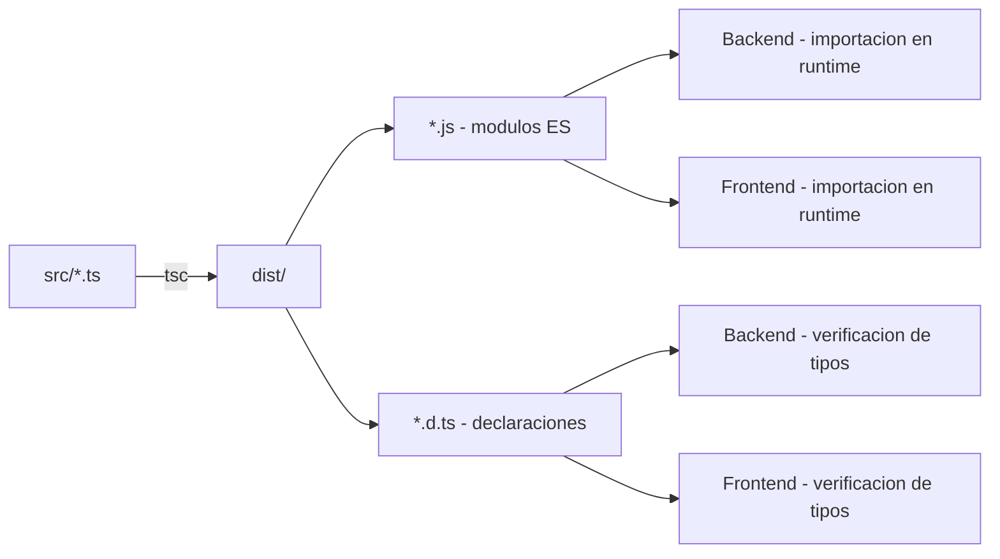

# @kotrip/data

Paquete compartido de tipos, enums y constantes de la plataforma Kotrip. Sirve como fuente única de verdad para las definiciones de datos utilizadas tanto por el backend como por el frontend, garantizando la coherencia de tipos en toda la plataforma.

## Características

- Sin dependencias de runtime (solo TypeScript como devDependency)
- Módulos ES nativos (ESM)
- Declaraciones de tipos generadas automáticamente
- Documentación generada con TypeDoc

## Estructura del código fuente

```
src/
  index.ts                       # Punto de entrada con re-exportaciones
  modules/
    auth/
      enums.ts                   # OtpPurpose (verificacion, recuperacion)
    storage/
      constants.ts               # KOTRIP_BUCKET, funciones de ruta para ficheros
    trip/
      enums.ts                   # TripStatus, InvitationStatus, TravelMethod
      constants.ts               # Limites de validacion (nombres, descripciones, etc.)
    user/
      enums.ts                   # Role, Language, UserStatus
      constants.ts               # Limites de nombre y contrasena, salt rounds
      role-groups.ts             # Grupos de roles predefinidos (ADMINS, ALL_ROLES)
```

## Módulos

### auth

Enumeraciones relacionadas con la autenticación:

- OtpPurpose: propósito de los códigos OTP (REGISTRATION_VERIFICATION, PASSWORD_RECOVERY).

### storage

Constantes y funciones auxiliares para el almacenamiento de ficheros en MinIO:

- KOTRIP_BUCKET: nombre del bucket unificado para todos los ficheros de la plataforma.
- getUserAvatarPath(userId, fileName): genera la ruta de almacenamiento para avatares de usuario.
- getTripTicketPath(tripId, ticketId, fileName): genera la ruta de almacenamiento para tickets de viaje.

### trip

Enumeraciones y constantes del dominio de viajes:

Enumeraciones:

- TripStatus: PLANNED, ACTIVE, FINISHED, CANCELLED.
- InvitationStatus: PENDING, ACCEPTED, REJECTED.
- TravelMethod: CAR, WALKING.

Constantes de validación:

- Nombre de viaje: mínimo 3, máximo 100 caracteres.
- Descripción de viaje: máximo 2000 caracteres.
- Puntuación: rango 1 a 10.
- Rol decorativo de miembro: máximo 50 caracteres.
- Nombre de parada: máximo 200 caracteres.
- Nombre de ticket: máximo 200 caracteres.
- Descripción de ticket: máximo 1000 caracteres.
- URL de ticket: máximo 2048 caracteres.

### user

Enumeraciones, constantes y grupos de roles del dominio de usuarios:

Enumeraciones:

- Role: USER, ADMIN.
- Language: en, es, gl (códigos BCP 47).
- UserStatus: BLOCKED, REJECTED, PENDING_REVIEW, PENDING_VERIFICATION, APPROVED, IMPORTED.

Constantes:

- Nombre: mínimo 3, máximo 30 caracteres.
- Contraseña: mínimo 8, máximo 50 caracteres.
- Bcrypt salt rounds: 10.

Grupos de roles:

- RoleGroups.ADMINS: [Role.ADMIN].
- RoleGroups.ALL_ROLES: [Role.USER, Role.ADMIN].

## Uso desde otros paquetes

El paquete se importa con el nombre del workspace:

```typescript
import { KOTRIP_BUCKET, Role, TripStatus } from '@kotrip/data';
import { getUserAvatarPath } from '@kotrip/data/modules/storage/constants';
```

El patrón de exportación permite tanto la importación desde el índice raíz como la importación directa de submódulos:

```json
{
  ".": { "types": "./dist/index.d.ts", "default": "./dist/index.js" },
  "./*": { "types": "./dist/*.d.ts", "default": "./dist/*.js" }
}
```

## Comandos

```bash
npm run build              # Compilar TypeScript a JavaScript + declaraciones
npm run build:watch        # Compilar en modo watch
npm run clean              # Eliminar directorio dist/
npm run qa:docs            # Generar documentacion con TypeDoc
npm run qa:docs:watch      # Regenerar documentacion en modo watch
npm run qa:docs:serve      # Generar y servir documentacion localmente
```

## Flujo de compilación



La compilación se ejecuta automáticamente durante el paso `prepare` de npm, asegurando que los tipos estén disponibles tras cada instalación de dependencias.
