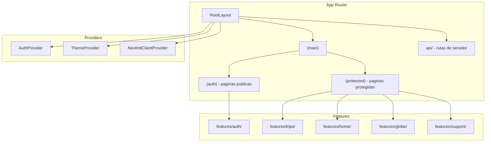
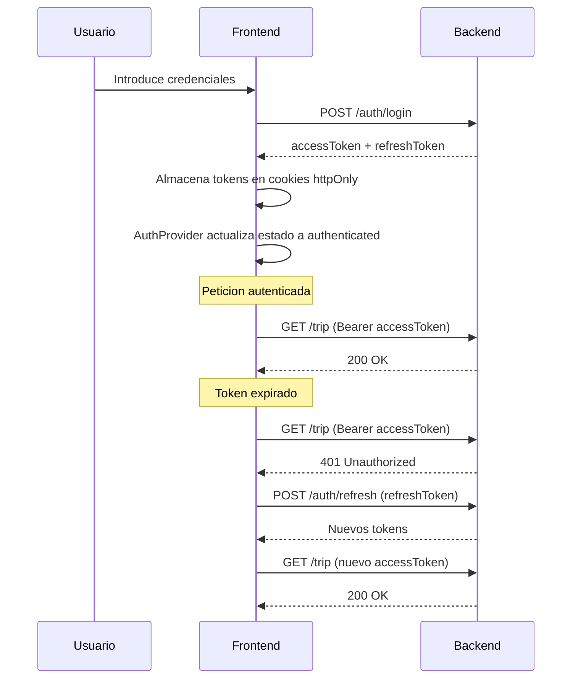

# @kotrip/frontend

Aplicación web de la plataforma Kotrip, construida con Next.js 16 (App Router) y React 19. Implementa una interfaz de usuario completa para la gestión de viajes, con autenticación, internacionalización, mapas interactivos y un sistema de diseño basado en Tailwind CSS y HeroUI.

## Stack tecnológico

| Categoría            | Tecnología                                      |
| -------------------- | ----------------------------------------------- |
| Framework            | Next.js 16 (App Router, React 19)               |
| Estilos              | Tailwind CSS 4, HeroUI v3 (beta)                |
| Cliente API          | openapi-fetch (tipado automático desde OpenAPI) |
| Formularios          | React Hook Form + Zod                           |
| Internacionalización | next-intl (ES, EN, GL)                          |
| Editor de texto      | Tiptap (WYSIWYG)                                |
| Mapas                | Leaflet + react-leaflet                         |
| Gráficos             | ApexCharts                                      |
| Drag and drop        | @hello-pangea/dnd                               |
| Iconos               | Lucide React                                    |
| Notificaciones       | Sonner (toasts)                                 |
| Documentación        | TypeDoc                                         |

## Arquitectura

El frontend sigue una organización por funcionalidad (Screaming Architecture), donde cada directorio de primer nivel dentro de `features/` representa un dominio de negocio autocontenido.



### Por qué Screaming Architecture

A medida que los proyectos crecen, una organización por tipo de archivo (components/, hooks/, services/) dificulta encontrar y modificar una funcionalidad concreta, ya que sus archivos quedan dispersos en múltiples carpetas. La organización por features agrupa todo lo relacionado con un dominio bajo un mismo directorio, facilitando la navegación y la colaboración.

Criterio de ubicación:

- En `components/`: componentes reutilizables en múltiples partes de la aplicación (botones, inputs, layouts).
- En `features/x/`: componentes, hooks, servicios y lógica que pertenecen exclusivamente a esa funcionalidad.

## Estructura del código fuente

```
src/
  app/                            # Next.js App Router
    layout.tsx                    # Layout raiz con providers
    (main)/
      (auth)/                     # Paginas de autenticacion (solo invitados)
        login/
        register/
        recover-password/
      (protected)/                # Paginas protegidas (requieren sesion)
        home/
        trips/
        globe/
        invitations/
        support/
    api/
      storage/[...path]/          # Proxy de ficheros hacia MinIO

  features/                       # Modulos organizados por dominio
    auth/                         # Autenticacion
      components/                 # Formularios, guards, paneles
      providers/                  # Context providers de sesion
      hooks/                      # useSession
      views/                      # Componentes de pagina
      actions.ts                  # Server Actions (RSA)
      api.ts                      # Llamadas API
    trips/                        # Gestion de viajes
      components/
      services/                   # Llamadas API tipadas
      utils/
      views/
    i18n/                         # Internacionalizacion
      routing.ts                  # Navegacion con i18n
      constants.ts                # Configuracion de locales
      messages/                   # Archivos de traduccion (es, en, gl)
      request.ts                  # Middleware de i18n
    theme/                        # Tema oscuro/claro
      provider/
      hooks/
    errors/                       # Paginas de error
    files/                        # Subida de ficheros
    home/                         # Dashboard
    globe/                        # Visualizacion de globo
    support/                      # Peticiones de soporte
    routing/                      # Registro de rutas y sidebar

  components/                     # Componentes reutilizables
    layout/                       # Layouts (protegido, publico)
    modules/                      # Componentes compuestos (topbar, footer, navbar, sidebar)
    ui/                           # Componentes atomicos (loaders, input-otp, toggle)

  lib/                            # Utilidades centrales
    backend/
      client.ts                   # Cliente OpenAPI con middleware de autenticacion
      types.ts                    # Tipos del backend
      openapi.d.ts                # Esquema OpenAPI generado
    fetch.ts                      # Manejo de errores API
    pagination/                   # Paginacion por cursor
    schemas/                      # Esquemas Zod de validacion
    utils/
    cache/                        # Perfiles de cache

  hooks/                          # Hooks globales
  types/                          # Tipos globales
  config/                         # Configuracion de la aplicacion
  constants/                      # Constantes
  styles/
    globals.css                   # Punto de entrada de Tailwind + variables de tema
```

## Flujo de autenticación



El middleware del cliente API intercepta respuestas 401 y ejecuta automáticamente el refresco de tokens con un patrón mutex para evitar refrescos concurrentes.

## Sistema de protección de rutas

Las páginas protegidas usan el wrapper `composePage()` con configuración inline (parseada por AST):

```tsx
export default composePage({
  component: MyPage,
  access: { roles: [Role.USER] },
  sidebar: { labelKey: 'sidebar.myPage', icon: BookOpen, order: 30 },
});
```

Guards disponibles:

- ServerAuthGuard: verificación en el servidor (RSC), redirige si no hay sesión.
- ClientAuthGuard: verificación en cliente con renderizado condicional.
- RouteClientGuard: envuelve rutas protegidas.

## Internacionalización

Idiomas soportados:

- Español (es, por defecto)
- Inglés (en)

La configuración de idioma se almacena en una cookie, no en la URL. Este enfoque evita problemas con el historial del navegador: al cambiar de idioma con sub-path routing, se añade una entrada al historial, de forma que al pulsar "atrás" el usuario vuelve al idioma anterior en lugar de a la página anterior. Con cookies esto no ocurre.

Los archivos de traducción están en `src/features/i18n/messages/`. Los tipos se autogeneran a partir del archivo principal en español.

Nota sobre el layout raíz: se incluye un `<Suspense>` sobre el `NextIntlClientProvider` para cumplir con la política de cache de Next.js/React. El acceso a cookies es asíncrono, y el documento HTML inicial no puede depender de funciones asíncronas sin este boundary.

## Estilos y tema

El sistema de estilos se basa en Tailwind CSS 4 con variables CSS personalizadas para la paleta de colores. HeroUI proporciona componentes base con soporte para tema oscuro.

La paleta se genera programáticamente con una escala de intensidad por niveles (50 a 950), donde los números bajos representan tonos claros y los altos tonos oscuros. Los colores base se definen en formato OKLCH y la escala se interpola automáticamente entre blanco y negro.

Paleta de colores:

| Color              | Uso principal                     |
| ------------------ | --------------------------------- |
| Primary (verde)    | Acciones principales, enlaces     |
| Secondary (dorado) | Elementos de acento               |
| Success (turquesa) | Confirmaciones, estados positivos |
| Error (rojo)       | Errores, estados negativos        |
| Warning (ámbar)    | Advertencias                      |
| Info (azul)        | Información contextual            |
| Smoke (gris)       | Fondos, bordes, estados neutros   |

El tema oscuro es el modo predeterminado. El cambio de tema se controla mediante el atributo `data-theme` en el HTML, con un `ThemeServerBoundary` bajo `<Suspense>` para acceder a la cookie de tema de forma asíncrona.

## Cache de datos

El frontend define perfiles de cache nombrados en la configuración de Next.js:

| Perfil | Stale (s) | Expire (s) | Uso |
| --- | --- | --- | --- |
| dashShort | 60 | 300 | Datos del dashboard con alta frecuencia de cambio |
| dashMedium | 300 | 1800 | Datos del dashboard con frecuencia media |
| profileShort | 300 | 1800 | Datos de perfil de usuario |

## Comandos

```bash
npm run build              # Build de produccion
npm run start:dev          # Servidor de desarrollo (con Webpack)
npm run start:prod         # Servidor de produccion (standalone)
npm run qa:compile         # Verificacion de tipos
npm run qa:lint            # Linting con ESLint
npm run qa:lint:fix        # Corregir problemas de lint
npm run qa:docs            # Generar documentacion con TypeDoc
npm run qa:i18n-sync       # Sincronizar traducciones
npm run routes:generate    # Regenerar registro de rutas
```

## Generación de tipos del backend

Los tipos de la API se generan automáticamente a partir del esquema OpenAPI que expone el backend. Para regenerarlos, reiniciar el contenedor del frontend mientras el backend está escuchando:

```bash
docker compose restart frontend
```

Los tipos generados se almacenan en `src/lib/backend/openapi.d.ts`.
